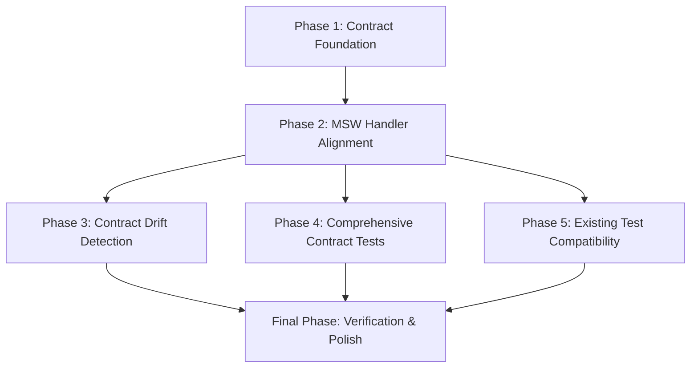

# Story 22 – MSW & API Contract Synchronization

## Implementation Plan

### Overview

This story eliminates divergence between the MSW mock handlers and the real backend API contract. The current MSW implementation has several behavioral mismatches: it silently corrects invalid parameters instead of returning 400 errors, lacks proper ObjectId validation, doesn't match exact error messages, doesn't implement sorting, and has inconsistent PATCH/POST validation semantics.

The plan implements a contract-driven MSW approach where the backend's OpenAPI spec serves as the source of truth, with generated contract fixtures feeding MSW handlers. This ensures frontend tests exercise a faithful representation of the API.

#### Out of Scope

- Backend changes (the backend is the contract authority)
- Members/Readings modules (only Books module in scope)
- Visual/UI changes (this is purely test infrastructure)
- Performance optimization of MSW handlers

---

## Phases

### Phase 1 – Contract Foundation

**Goal:** Establish the contract fixture layer derived from the backend OpenAPI spec, and create validation utilities that mirror backend behavior exactly.

#### Tasks

1. Extract OpenAPI schema definitions for `Book`, `CreateBookDto`, `UpdateBookDto`, `BookQueryDto`, `PaginatedResponse`, `ErrorResponse` into typed fixtures.
2. Create `contract/` directory under `src/test/contract/` for shared contract types and validation logic.
3. Implement backend-mirroring validators:
   - `validateObjectId(id: string): boolean` — exact `mongoose.Types.ObjectId.isValid` behavior
   - `validateGenre(genre: string): boolean` — exact `Object.values(Genre).includes` behavior
   - `validatePage(page: unknown): { valid: boolean; error?: string }` — matches controller logic (integer $\ge$ 1)
   - `validateLimit(limit: unknown): { valid: boolean; error?: string }` — matches controller logic (integer 1–100)
   - `validateRequiredBody(body: unknown): { valid: boolean; error?: string }` — matches "Request body is missing"
   - `validateEmptyBody(body: unknown): { valid: boolean; error?: string }` — matches "Request body is missing" for PATCH
4. Create error message constants matching backend exactly:
   - `"Invalid ID"`, `"Invalid genre"`, `"Invalid page value"`, `"Invalid limit value"`
   - `"Request body is missing"`, `"Book already exists."`, `"Book not found"`
   - `"Internal Server Error"`, `"Validation failed"`
5. Add contract test utilities for asserting MSW responses match backend contract shape.

#### Files

- `src/test/contract/types.ts` — TypeScript types mirroring backend DTOs and responses
- `src/test/contract/validators.ts` — Pure validation functions (no MSW deps)
- `src/test/contract/error-messages.ts` — Exact error message strings from backend
- `src/test/contract/assertions.ts` — Test helpers: `expectContractResponse`, `expectValidationError`, etc.

#### Deliverables

- Contract types that can be shared between MSW handlers and test assertions
- Validators that produce identical pass/fail results as backend controllers
- Zero-runtime-dependency validation logic (pure TS, testable in isolation)

---

### Phase 2 – MSW Handler Alignment

**Goal:** Update all MSW book handlers to use contract validators and return responses identical to the backend in status codes, body structure, error messages, and pagination/sorting behavior.

#### Tasks

##### 2.1 GET /api/books — List with filters, pagination, sorting

- Apply sorting: `title: 1` (ascending) before pagination
- Replace silent `Math.max(1, page)` with `validatePage` $
ightarrow$ 400 on invalid
- Replace silent `Math.min(100, limit)` with `validateLimit` $
ightarrow$ 400 on invalid
- Add `validateGenre` $
ightarrow$ 400 on invalid genre with message `"Invalid genre"`
- Preserve correct pagination metadata on empty pages (`page > totalPages`)

##### 2.2 GET /api/books/:id — Get by ID

- Add `validateObjectId` check before lookup $
ightarrow$ 400 `"Invalid ID"` on invalid format
- Keep 404 `"Book not found"` for valid but non-existent IDs

##### 2.3 POST /api/books — Create

- Check body presence first $
ightarrow$ 400 `"Request body is missing"` if missing/empty
- Validate required fields via contract schema $
ightarrow$ 400 `"Validation failed"` with field details
- Validate genre via `validateGenre` $
ightarrow$ 400 with field details
- Keep 409 `"Book already exists."` for duplicate title+author
- Return 201 with created book

##### 2.4 PATCH /api/books/:id — Partial update

- Add `validateObjectId` $
ightarrow$ 400 `"Invalid ID"`
- Check body presence $
ightarrow$ 400 `"Request body is missing"` if empty object
- Validate genre if provided $
ightarrow$ 400 with field details
- Keep 404 for valid non-existent ID
- Keep 409 for duplicate title+author
- Apply partial update semantics (merge, not replace)
- Run validators conceptually (mirror `runValidators: true`)

##### 2.5 DELETE /api/books/:id — Delete

- Add `validateObjectId` $
ightarrow$ 400 `"Invalid ID"`
- Keep 404 for valid non-existent ID
- Return 204 no content

##### 2.6 Error response normalization

- All 400 responses: `{ message, code: "VALIDATION_ERROR", details? }`
- All 404 responses: `{ message: "Book not found", code: "NOT_FOUND" }` (or custom message)
- All 409 responses: `{ message: "Book already exists.", code: "CONFLICT" }`
- All 500 responses: `{ message: "Internal Server Error", code: "INTERNAL_ERROR" }`

#### Files

- `src/test/handlers/books.ts` — Fully rewritten handlers using contract validators
- `src/test/handlers/errors.ts` — Minor updates to ensure message consistency

#### Deliverables

- MSW handlers that pass all backend integration test scenarios when exercised against them
- Identical status codes, error messages, response shapes for every endpoint

---

### Phase 3 – Contract Drift Detection

**Goal:** Implement automated strategy to detect contract drift between backend OpenAPI spec and MSW handlers.

#### Tasks

1. Add script to fetch OpenAPI spec from backend (`GET /api/docs/swagger.json`) or read local file.
2. Create `contract:extract` script that parses OpenAPI and generates/updates:
   - `src/test/contract/openapi-types.ts` — TypeScript interfaces from `components.schemas`
   - `src/test/contract/endpoints.ts` — Endpoint definitions with parameters, responses, error codes
3. Create `contract:verify` script that:
   - Compares MSW handler behavior against OpenAPI-defined responses
   - Validates that all defined error codes (400, 404, 409, 500) are handled
   - Validates pagination response structure matches `PaginatedResponse` schema
   - Validates sorting behavior is documented and implemented
4. Add npm scripts to `package.json`:
   - `contract:extract` — Run extraction (manual or CI)
   - `contract:verify` — Run verification (CI gate)
   - `contract:check` — Runs both (pre-commit or CI)
5. Configure CI to run `contract:check` in frontend pipeline.

#### Files

- `scripts/contract/extract.ts` — OpenAPI parsing and type generation
- `scripts/contract/verify.ts` — MSW vs OpenAPI comparison logic
- `package.json` — New script entries
- `.github/workflows/frontend-ci.yml` — Add contract verification step

#### Deliverables

- Automated drift detection running in CI
- Generated contract types always in sync with backend
- Failed CI when MSW diverges from OpenAPI contract

---

### Phase 4 – Comprehensive Contract Tests

**Goal:** Create a test suite that verifies MSW behavior matches the backend contract for every scenario covered by backend integration tests.

#### Tasks

Create new test file `src/test/contract/msw-contract.test.ts` with test cases covering:

##### Successful Responses

- `GET /api/books` returns 200 with paginated data sorted by title asc
- `GET /api/books` with filters (genre, author, title) returns filtered results
- `GET /api/books/:id` returns 200 with book
- `POST /api/books` returns 201 with created book
- `PATCH /api/books/:id` returns 200 with updated book (partial update)
- `DELETE /api/books/:id` returns 204

##### Validation Errors (400)

- Invalid ObjectId format on `GET`/`PATCH`/`DELETE` `:id` $
ightarrow$ 400 `"Invalid ID"`
- Invalid genre on `GET`/`PATCH` $
ightarrow$ 400 `"Invalid genre"` with details
- Invalid page (negative, zero, non-numeric) $
ightarrow$ 400 `"Invalid page value"`
- Invalid limit (negative, zero, >100, non-numeric) $
ightarrow$ 400 `"Invalid limit value"`
- Missing body on `POST` $
ightarrow$ 400 `"Request body is missing"`
- Empty body on `PATCH` $
ightarrow$ 400 `"Request body is missing"`
- Missing required fields on `POST` $
ightarrow$ 400 `"Validation failed"` with field details
- Mongoose-style validation errors on `PATCH` (invalid genre enum) $
ightarrow$ 400 with details

##### Not Found (404)

- Valid ObjectId but non-existent on `GET`/`PATCH`/`DELETE` $
ightarrow$ 404 `"Book not found"`

##### Conflict (409)

- Duplicate title+author on `POST` $
ightarrow$ 409 `"Book already exists."`
- Duplicate title+author on `PATCH` $
ightarrow$ 409 `"Book already exists."`

##### Server Errors (500)

- Simulated handler failure $
ightarrow$ 500 `"Internal Server Error"`

##### Pagination

- Default page=1, limit=10
- Page boundaries (first, middle, last, beyond totalPages)
- Correct metadata: page, limit, total, totalPages
- Empty page beyond totalPages returns 200 with empty data

##### Sorting

- Results always sorted by title ascending regardless of insertion order

#### Files

- `src/test/contract/msw-contract.test.ts` — Comprehensive contract verification tests

#### Deliverables

- Test suite that fails if MSW diverges from backend contract
- Coverage for all acceptance criteria scenarios

---

### Phase 5 – Existing Test Compatibility & Cleanup

**Goal:** Ensure all existing frontend tests continue to pass with the corrected MSW handlers, and update any tests that relied on incorrect MSW behavior.

#### Tasks

1. Run full frontend test suite (`npm run test:run`).
2. Identify and fix broken tests — tests that assumed:
   - Silent page/limit correction (now 400)
   - Invalid genre returns empty array (now 400)
   - Invalid ObjectId returns 404 (now 400)
   - Different error messages
3. Update test expectations in:
   - `src/features/books/hooks/useBooks.test.ts`
   - `src/features/books/hooks/useBook.test.ts`
   - `src/features/books/hooks/useCreateBook.test.ts`
   - `src/features/books/hooks/useUpdateBook.test.ts`
   - `src/features/books/hooks/useDeleteBook.test.ts`
   - `src/pages/BooksPage.test.tsx`
   - `src/pages/BookDetailsPage.test.tsx`
   - `src/pages/CreateBookPage.test.tsx`
   - `src/pages/EditBookPage.test.tsx`
4. Verify component tests still pass (`FilterBar`, `SearchBar`, `Pagination`, etc.).
5. Remove any workarounds in tests that compensated for MSW inaccuracies.

#### Files

- Multiple existing test files (updated in place)

#### Deliverables

- 100% existing test pass rate
- No test depends on incorrect MSW behavior

---

### Final Phase – Verification & Polish

**Goal:** Final quality gates, documentation updates, and CI integration.

#### Tasks

1. **Code quality checks:**
   - `npm run lint` — ESLint passes
   - `npx tsc --noEmit` — TypeScript compiles without errors
   - `npm run test:run` — All tests pass
   - `npm run test:coverage` — Coverage maintained/improved
2. **Manual verification:**
   - Run `contract:check` script successfully
   - Verify frontend dev server works with MSW (`npm run dev`)
   - Spot-check Books page pagination, filtering, create/edit/delete flows
3. **Documentation updates:**
   - Update `docs/frontend-testing.md` if MSW patterns changed
   - Update `docs/design/design-system.md` if any design tokens affected (unlikely)
   - Document contract-driven MSW approach in `docs/frontend-context.md` if architectural
4. **CI verification:**
   - Confirm frontend CI passes with new contract verification step

#### Files

- `docs/frontend-testing.md` — Update if testing conventions changed
- `docs/frontend-context.md` — Document contract-driven MSW strategy if new

#### Deliverables

- Clean CI run
- Updated documentation reflecting contract-driven approach

---

## Testing Scope

### Component Tests

| Component            | Test File                                             | Scenarios                               |
| :------------------- | :---------------------------------------------------- | :-------------------------------------- |
| **BookTable**        | `features/books/components/BookTable.test.tsx`        | Rendering, sorting display, empty state |
| **FilterBar**        | `features/books/components/FilterBar.test.tsx`        | Filter inputs, genre select, submit     |
| **SearchBar**        | `features/books/components/SearchBar.test.tsx`        | Title/author inputs, debounce           |
| **Pagination**       | `shared/components/ui/Pagination.test.tsx`            | Page controls, aria, keyboard nav       |
| **BookForm**         | `features/books/components/BookForm.test.tsx`         | Validation, submission, error display   |
| **GenreFilter**      | `features/books/components/GenreFilter.test.tsx`      | Genre selection                         |
| **DeleteBookButton** | `features/books/components/DeleteBookButton.test.tsx` | Confirmation modal, delete action       |
| **BookDetails**      | `features/books/components/BookDetails.test.tsx`      | Display, not-found state                |

### Hook / Service Tests

| Hook              | Test File                                    | Scenarios                                                                              |
| :---------------- | :------------------------------------------- | :------------------------------------------------------------------------------------- |
| **useBooks**      | `features/books/hooks/useBooks.test.ts`      | Loading, success, error, cache separation, pagination params                           |
| **useBook**       | `features/books/hooks/useBook.test.ts`       | Loading, success, not-found, error, cache separation                                   |
| **useCreateBook** | `features/books/hooks/useCreateBook.test.ts` | Idle, pending, success, validation error, conflict, internal error, cache invalidation |
| **useUpdateBook** | `features/books/hooks/useUpdateBook.test.ts` | Idle, pending, success, validation error, not-found, conflict, cache invalidation      |
| **useDeleteBook** | `features/books/hooks/useDeleteBook.test.ts` | Idle, pending, success, not-found, internal error, cache invalidation                  |

### Integration Tests

| Page                | Test File                        | Scenarios                                                                     |
| :------------------ | :------------------------------- | :---------------------------------------------------------------------------- |
| **BooksPage**       | `pages/BooksPage.test.tsx`       | Full catalog flow: load, filter, paginate, search, URL sync, skeleton loading |
| **BookDetailsPage** | `pages/BookDetailsPage.test.tsx` | Load detail, not-found, back navigation                                       |
| **CreateBookPage**  | `pages/CreateBookPage.test.tsx`  | Form validation, submit success, error handling, navigation                   |
| **EditBookPage**    | `pages/EditBookPage.test.tsx`    | Load existing, partial update, validation, conflict, cache invalidation       |

---

## File Structure

```text
src/test/
├── contract/
│   ├── types.ts                # Contract types from OpenAPI
│   ├── validators.ts           # Backend-mirroring validators
│   ├── error-messages.ts       # Exact error message constants
│   ├── assertions.ts           # Contract test helpers
│   ├── openapi-types.ts        # Generated from OpenAPI (gitignored or committed)
│   ├── endpoints.ts            # Generated endpoint definitions
│   └── msw-contract.test.ts    # Comprehensive contract verification
├── handlers/
│   ├── books.ts                # Rewritten MSW handlers using contract validators
│   └── errors.ts               # Error helpers (minor updates)
├── utils/
│   ├── factories/
│   │   └── book.factory.ts     # Existing (may need minor updates)
│   └── ...
scripts/
├── contract/
│   ├── extract.ts              # OpenAPI → contract types generator
│   └── verify.ts               # MSW vs OpenAPI verification
frontend/
├── package.json                # New scripts: contract:extract, contract:verify, contract:check
└── .github/workflows/
    └── frontend-ci.yml         # Add contract:check step
docs/
├── frontend-testing.md         # Update if conventions changed
└── frontend-context.md         # Document contract-driven MSW strategy
```

---

## Implementation Sequence



### Recommended Commit Order

1. **Phase 1:** Add `src/test/contract/` with types, validators, error-messages, assertions
2. **Phase 2:** Rewrite `src/test/handlers/books.ts` using contract validators
3. **Phase 3:** Add `scripts/contract/` extraction/verification, update `package.json`, update CI
4. **Phase 4:** Add `src/test/contract/msw-contract.test.ts`
5. **Phase 5:** Fix all existing tests broken by corrected MSW behavior
6. **Final:** Lint, typecheck, test:run, coverage, doc updates

---

## Design System Compliance

This story is test infrastructure only — no UI components are created or modified. However, the implementation must respect:

- **Colors:** N/A (no UI)
- **Typography:** N/A
- **Spacing:** N/A
- **Border Radius:** N/A
- **Shadows:** N/A
- **Motion:** N/A
- **Accessibility:** Test utilities should not break accessibility assertions in component tests (e.g., `getByRole` queries must continue to work)

---

## Dependencies

| Category                    | Dependency                                                                                               |
| :-------------------------- | :------------------------------------------------------------------------------------------------------- |
| **Backend endpoints**       | `GET`/`POST`/`PATCH`/`DELETE` `/api/books`, `GET /api/docs/swagger.json`                                 |
| **Frontend infrastructure** | MSW v2, Vitest, React Testing Library, TanStack Query                                                    |
| **Shared components**       | None (test-only)                                                                                         |
| **Testing infrastructure**  | `src/test/setup.ts`, `src/test/server.ts`, `src/test/utils/render.tsx`, `src/test/utils/query-client.ts` |
| **Design system**           | None                                                                                                     |

---

## Risks & Mitigations

| Risk                                                      | Likelihood | Impact | Mitigation                                                                                       |
| :-------------------------------------------------------- | :--------: | :----: | :----------------------------------------------------------------------------------------------- |
| **Existing tests break due to corrected MSW behavior**    |    High    | Medium | Dedicate Phase 5 strictly to updating test assertions matching real API behavior.                |
| **OpenAPI parsing complexity**                            |   Medium   |  Low   | Use standard OpenAPI parsers (e.g., `swagger-parser` or simple JSON mapping).                    |
| **Contract drift detection false positives**              |    Low     | Medium | Ensure verification script focuses on structural schema and status code alignment.               |
| **Validator logic diverges from backend over time**       |   Medium   |  High  | Keep validators modular and assert against actual backend OpenAPI schemas via Phase 3 CI checks. |
| **Performance impact of stricter validation in MSW**      |    Low     |  Low   | Keep validators synchronous, pure, and memory-light.                                             |
| **Sorting behavior affects pagination test expectations** |   Medium   |  Low   | Verify test dataset order or update expected arrays in hook/page tests.                          |

---

## Acceptance Criteria Mapping

| Acceptance Criterion                                               | Phase                                                     |
| :----------------------------------------------------------------- | :-------------------------------------------------------- |
| MSW returns the same relevant status codes as the backend          | Phase 2, verified in Phase 4                              |
| MSW returns the same response structures                           | Phase 2, verified in Phase 4                              |
| MSW uses the same relevant error messages                          | Phase 2 (`error-messages.ts`), verified in Phase 4        |
| MSW correctly implements pagination                                | Phase 2 (`GET /api/books`), verified in Phase 4           |
| MSW correctly implements sorting                                   | Phase 2 (`title: 1` asc), verified in Phase 4             |
| MSW correctly implements PATCH semantics                           | Phase 2 (partial update, validators), verified in Phase 4 |
| Existing frontend tests continue to pass                           | Phase 5                                                   |
| There is an automated strategy capable of detecting contract drift | Phase 3 (`contract:verify` in CI)                         |

---

## Definition of Done

- **Phase 1:** Contract types, validators, error messages, assertions created and unit-tested.
- **Phase 2:** All MSW book handlers rewritten using contract validators; manual spot-check passes.
- **Phase 3:** `contract:extract` and `contract:verify` scripts work; added to CI; CI passes.
- **Phase 4:** `msw-contract.test.ts` covers all backend integration test scenarios; all pass.
- **Phase 5:** `npm run test:run` passes 100% (all existing tests green).
- **Final:** `npm run lint` passes, `npx tsc --noEmit` passes, `npm run test:coverage` acceptable.
- **Final:** Documentation updated if conventions changed.
- **Final:** No hardcoded error messages or validation logic remains in MSW handlers (all via contract).
